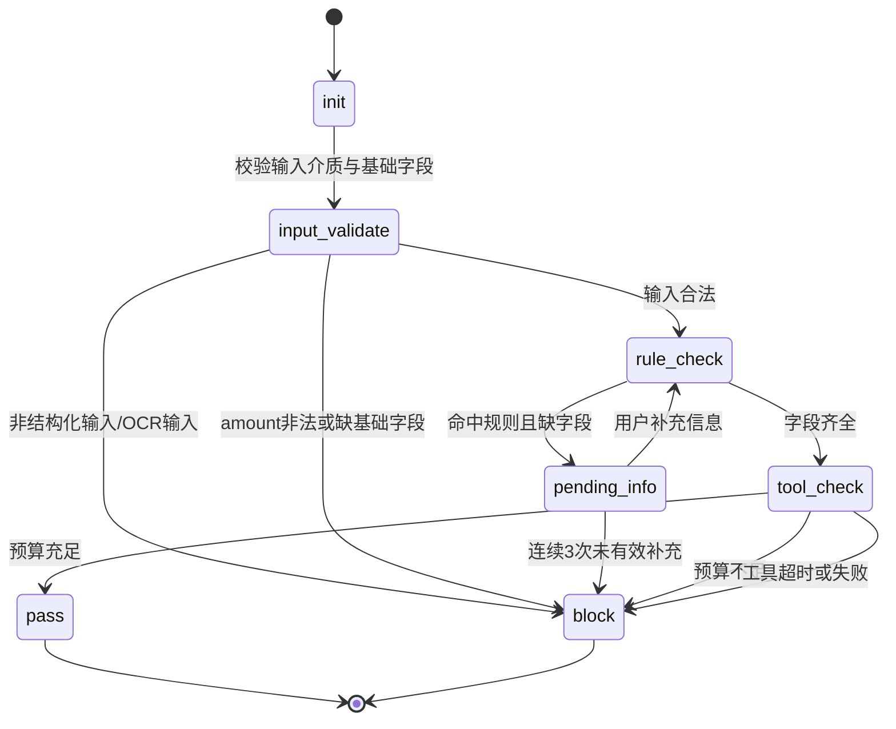

# AI报销预审助手 (Agent版) MVP PRD

## 1. 文档信息
- 版本：v1.2
- 状态：可开发/可演示
- 目标读者：产品经理、前端/后端开发、测试

## 2. 产品定位
面向企业内部报销场景的合规预审 Agent。员工在正式提交单据前，通过自然语言交互完成“自动识别规则、主动追问缺失信息、调用预算工具、输出结构化结论”，减少财务重复沟通与基础核对成本。

## 3. 目标与非目标
### 3.1 目标 (Goals)
1. 在单据提交前拦截显性违规与信息缺失。
2. 通过多轮追问补齐关键字段，降低人工来回沟通。
3. 展示 ReAct + Function Calling 的完整闭环。
4. 输出前端可消费的标准化 JSON 状态，便于 UI 驱动。

### 3.2 非目标 (Non-Goals)
1. 不替代正式财务审批流，不进行最终财务入账。
2. 不覆盖全部费用类型，仅覆盖 MVP 核心场景。
3. 不接入真实 ERP，仅使用可替换的模拟工具接口。
4. 不包含 OCR/票据识别能力，不处理图片或 PDF 抽取。

### 3.3 MVP 前置假设与输入边界（无 OCR）
本 MVP 明确以前端已成功获取并传入结构化发票 JSON 为起点。Agent 负责“规则判断、缺失追问、预算校验、结论输出”，不负责票据图片/PDF 的 OCR 识别与字段抽取。

前置假设：
1. 前端提交的数据已完成基础结构化，字段命名遵循 `7.1 前端输入 Schema`。
2. 若上游存在 OCR/录入系统，其输出已在进入 Agent 前完成字段映射与清洗。
3. 本 PRD 只定义“决策层（Agent）”行为，不定义“识别层（OCR）”实现细节。

## 4. 核心 MVP 场景
### 4.1 场景名称
业务招待费合规预审。

### 4.2 核心规则 (V1)
当 `expense_type=业务招待费` 且 `amount>500` 时，必须提供：
- `client_company_name`（客户企业全称）
- `accompanying_headcount`（内部陪同人数，正整数）

### 4.3 触发机制
前端提交“结构化单据 JSON + 用户自然语言附言”，Agent 自动启动预审流程。

## 5. 用户旅程与核心流程
### 5.1 用户旅程阶段
1. 员工录入/导入单据
2. Agent 识别并比对规则
3. 若缺信息则追问补齐
4. 调用预算工具
5. 输出通过/拦截/待补齐结论

### 5.2 流程图 (Mermaid)
```mermaid
flowchart TD
    A[前端提交结构化JSON + 用户附言] --> B{输入介质是否为结构化JSON}
    B -- 否 --> B1[返回 block\nreason=当前版本不支持OCR输入]
    B -- 是 --> C{基础字段是否合法\nsession_id/user_id/amount}
    C -- 否 --> C1[返回 block\nreason=输入参数非法]
    C -- 是 --> D[Agent 解析费用类型与金额]
    D --> E{是否命中业务招待费 且 金额>500}
    E -- 否 --> F[进入预算校验]
    E -- 是 --> G{关键信息是否齐全且格式正确}
    G -- 否 --> H[返回 pending_info\nrequired_fields + field_errors]
    H --> I[用户补充信息]
    I --> J{补充次数 < 3}
    J -- 是 --> G
    J -- 否 --> J1[返回 block\nreason=信息补充不完整]
    G -- 是 --> F
    F --> K[调用 query_department_budget(user_id)]
    K --> K1{工具是否成功返回}
    K1 -- 否 --> K2[返回 block\nreason=预算查询失败]
    K1 -- 是 --> L{available_budget >= amount}
    L -- 是 --> M[返回 pass + 操作指引]
    L -- 否 --> N[返回 block + 预算不足]
```

### 5.3 状态机 (Mermaid)


## 6. 决策表（必须实现）
| 条件编号 | 费用类型 | 金额 | 必填字段齐全 | 预算充足 | 输出状态 | 说明 |
|---|---|---:|---|---|---|---|
| R0 | 任意 | 非法/缺失 | - | - | block | 输入金额非法，直接拦截 |
| R1 | 非业务招待费 | 任意 | - | true | pass | 不命中招待费规则，预算通过 |
| R2 | 非业务招待费 | 任意 | - | false | block | 不命中招待费规则，但预算不足 |
| R3 | 业务招待费 | <=500 | - | true | pass | 金额未超阈值，预算通过 |
| R4 | 业务招待费 | <=500 | - | false | block | 金额未超阈值，但预算不足 |
| R5 | 业务招待费 | >500 | 否 | - | pending_info | 必填信息缺失，发起追问 |
| R6 | 业务招待费 | >500 | 是 | true | pass | 合规信息完整且预算通过 |
| R7 | 业务招待费 | >500 | 是 | false | block | 合规信息完整但预算不足 |

补充规则：
1. `amount=500` 视为“未超阈值”。
2. `accompanying_headcount` 必须为正整数；否则按缺失处理并追问。
3. `pending_info` 连续追问 3 次无有效补充，转 `block`。
4. 在 `pass/block` 场景下，`required_fields` 固定返回空数组 `[]`。
5. 预算是否充足由规则引擎按 `available_budget >= amount` 计算得出。
6. V1 预算桶按“员工所属部门月度通用报销预算”统一计算，不按费用类型拆桶；因此 R1/R2 对非业务招待费同样执行预算校验。

## 7. 数据结构定义
### 7.1 前端输入 Schema
```json
{
  "session_id": "SES_20260428_0001",
  "user_id": "EMP_001",
  "expense_type": "业务招待费",
  "amount": 850.0,
  "merchant": "XX大酒楼",
  "user_message": "报销昨晚请李总吃饭的费用",
  "client_company_name": "",
  "accompanying_headcount": null
}
```

字段约束：
- `session_id`: 必填，用于多轮会话上下文关联。
- `user_id`: 必填。
- `expense_type`: 必填，V1 枚举值仅支持“业务招待费”与“其他”；非枚举值（如“差旅费”“办公费”）在服务端归一化为“其他”。
- `amount`: 必填，非负数字。
- `client_company_name`: 条件必填（R5~R7）。
- `accompanying_headcount`: 条件必填（R5~R7），正整数。
- `user_message`: 可选自然语言补充上下文，不作为结构化字段的最终真值来源。

### 7.2 工具接口（Function Calling）
名称：`query_department_budget`

描述：查询指定员工所属部门当前可用预算。工具只返回预算原始值，不直接返回审批结论。

入参：
```json
{
  "user_id": "EMP_001"
}
```

返回：
```json
{
  "available_budget": 5000.0
}
```

异常返回（示例）：
```json
{
  "error_code": "BUDGET_TIMEOUT",
  "error_message": "budget service timeout"
}
```

### 7.3 Agent 标准输出 Schema（前端强依赖）
```json
{
  "status": "pending_info",
  "reason": "金额超过500元的业务招待费需补充信息",
  "ai_reply": "系统识别此单为业务招待费且超500元。请补充客户企业全称及内部陪同人数。",
  "required_fields": ["client_company_name", "accompanying_headcount"],
  "field_errors": [],
  "next_action": "wait_user_input",
  "tool_trace": {
    "budget_checked": false
  }
}
```

`status` 枚举：
- `pass`: 可提交下一环节
- `block`: 拦截并提示原因
- `pending_info`: 待补齐信息

`next_action` 枚举（前端据此驱动交互）：
- `wait_user_input`: 等待用户补充信息（对应 `pending_info`）
- `show_result`: 展示终态结果（对应 `pass` 或 `block`）
- `retry_allowed`: 可重试当前动作（仅用于工具超时/下游短暂失败）

`field_errors` 约定（可选数组）：
```json
[
  {
    "field": "accompanying_headcount",
    "code": "INVALID_FORMAT",
    "message": "内部陪同人数需为正整数"
  }
]
```

`tool_trace` 约定（完整结构）：
```json
{
  "budget_checked": true,
  "budget_request": {
    "user_id": "EMP_001"
  },
  "budget_response": {
    "available_budget": 5000.0
  },
  "compare_amount": 850.0,
  "is_sufficient": true,
  "error": null
}
```

`tool_trace` 规则：
- `pending_info`: `budget_checked=false`，其余字段可省略。
- `pass/block`（预算分支）：`budget_checked=true`，必须带 `compare_amount` 与 `is_sufficient`。
- 工具失败：`budget_checked=true`，`error` 必填（如 `{"code":"BUDGET_TIMEOUT","message":"..."}`）。

## 8. ReAct 与 Agent 行为要求
1. **Thought（内部）**：识别单据要素、命中规则、判断缺口，不向用户暴露链路细节。
2. **Action（外显）**：当缺字段时先追问；字段齐全后再调用预算工具。
3. **Observation（外显）**：读取工具返回，映射到标准状态输出。
4. **Response（外显）**：始终返回结构化 JSON，并附自然语言解释。

约束：
- 禁止跳过字段补齐直接调用预算接口。
- 禁止输出非 JSON 的终态响应（便于前端消费）。
- 文案语气友好、明确、可执行。

### 8.1 Agent 规划模式（MVP）
MVP 采用 ReAct 主流程，可选 Plan-and-Solve 作为扩展：
1. **ReAct（默认）**
   - 思考：判断费用类型、金额阈值、缺失字段。
   - 行动：发起追问或调用预算工具。
   - 观察：读取用户补充或工具返回。
   - 结论：输出 `pass/block/pending_info`。
2. **Plan-and-Solve（可选扩展）**
   - 先生成简短计划（例如“先补齐字段，再查预算，最后给结论”）。
   - 再按计划逐步执行，适用于后续多规则、多工具场景。

### 8.2 工具调用与函数调用（Function Calling）
定义：模型在需要外部信息时，不直接“编造答案”，而是按约定参数调用工具函数并使用返回结果做决策。

本 PRD 中的唯一工具：
- `query_department_budget(user_id)`：查询部门预算，返回 `available_budget`。

调用约束：
1. 仅在字段齐全后调用。
2. 调用失败必须进入异常分支，不得假设预算充足。
3. 工具返回结果必须体现在最终 JSON 的 `reason` 或 `tool_trace` 中。
4. `is_sufficient` 不由工具返回，由规则引擎按 `available_budget >= amount` 统一计算。
5. 工具失败时 `status=block` 且 `next_action=retry_allowed`，前端应渲染“重试”入口。

### 8.3 API 基础约定（产品可读）
1. **Endpoint（接口地址）**
   - `POST /api/precheck/run`：运行预审。
   - `POST /api/precheck/reply`：提交补充信息并继续预审。
2. **参数（Parameters）**
   - 请求体为 JSON，字段遵循 `7.1 前端输入 Schema`。
   - 必填字段缺失时返回参数错误。
3. **返回码（HTTP Status Code）**
   - `200`：业务请求已被处理，结果统一放在响应体 `status`（含 `pass/block/pending_info`）。
   - `400`：仅用于请求体不可解析（非 JSON）或缺少基础传输字段（如 `session_id`）。
   - `500`：服务内部未预期异常。
4. **业务状态与 HTTP 状态分离（统一响应策略）**
   - 金额非法、预算超时、规则拦截等业务问题，统一返回 `200 + status=block`。
   - 仅协议级错误使用非 200。

`POST /api/precheck/reply` 请求体示例：
```json
{
  "session_id": "SES_20260428_0001",
  "user_id": "EMP_001",
  "reply_message": "客户是上海某某科技有限公司，内部陪同2人",
  "client_company_name": "上海某某科技有限公司",
  "accompanying_headcount": 2
}
```

`POST /api/precheck/reply` 字段优先级与冲突处理（必须实现）：
1. **结构化字段优先**：`client_company_name`、`accompanying_headcount` 以显式结构化字段为准。
2. **自然语言仅作候选**：`reply_message` 可用于语义提取候选值，但不能覆盖同名结构化字段。
3. **冲突判定**：若结构化字段与 `reply_message` 提取值冲突，采用结构化字段，并在 `tool_trace` 写入 `conflict_detected=true`（可选扩展字段）。
4. **低置信度提取**：若仅有 `reply_message` 且提取置信度低（阈值由服务端配置），返回 `pending_info` 并继续追问，不自动落库。

`pending_info` 三次上限计数规则（必须实现）：
1. 计数单位是**会话级连续无效回复次数**（不是按字段分别计数）。
2. 每次调用 `/api/precheck/reply` 后，若仍为 `pending_info` 且“缺失字段数量与格式错误数量均未减少”，计数 +1。
3. 若本次回复使任一缺失/错误字段得到修复（部分补齐也算有效），计数重置为 0。
4. 当计数达到 3，返回 `block`，`reason=信息补充不完整`。
5. 计数状态由服务端基于 `session_id` 持久化，前端不参与计数。

`session_id` 上下文机制（必须实现）：
1. 服务端以 `session_id + user_id` 作为会话键保存上下文（最近结构化字段、计数状态、最近一次结果）。
2. 会话 TTL 默认 24 小时（可配置）；过期后按新会话处理。
3. 会话过期时调用 `/reply`，返回 `block` 且 `next_action=show_result`，`reason=会话已失效，请重新发起预审`。

### 8.4 Prompt 设计规范（MVP）
本节定义“哪些能力由 Prompt 驱动、哪些由确定性代码驱动”，避免模型越权。

#### 8.4.1 职责分层（必须遵守）
1. **Prompt 负责**：语义理解、追问文案、用户可读解释。
2. **代码/规则引擎负责**：阈值判断、状态流转、重试上限、Schema 校验、工具调用门禁。
3. **冲突处理原则**：若模型输出与规则引擎冲突，以规则引擎结果为准。
4. **`user_message/reply_message` 边界**：模型可做候选提取，但最终字段值以结构化字段与规则引擎校验结果为准。

#### 8.4.2 System Prompt（运行时主提示词）
```text
你是企业报销预审助手。你的任务是在“已结构化输入”的前提下，完成合规预审并输出严格JSON。

工作边界：
1) 不执行OCR，不处理图片/PDF识别。
2) 不跳过规则校验，不跳过缺失字段追问。
3) 仅在字段齐全时调用预算工具 query_department_budget。

业务规则：
- 当 expense_type=业务招待费 且 amount>500 时，必须提供：
  a) client_company_name
  b) accompanying_headcount（正整数）
- amount=500 视为未超阈值。
- pending_info 连续3次未补齐，返回 block。

输出要求：
1) 只输出JSON，不输出额外文本。
2) JSON字段必须包含：
   status, reason, ai_reply, required_fields, field_errors, next_action, tool_trace
3) status 仅允许：pass, block, pending_info。
4) 当 status 为 pass 或 block 时，required_fields 必须为 []。
5) 若字段格式错误，写入 field_errors，code 使用 INVALID_FORMAT。
```

#### 8.4.3 点位 Prompt（按流程调用）
1. **解析点位 Prompt（Extract）**
```text
请基于输入JSON和user_message，识别并补充候选字段：
- expense_type 是否可确认
- amount 是否合法
- client_company_name 是否缺失
- accompanying_headcount 是否缺失或格式非法
返回结构化判断，不做最终审批结论。
```

2. **追问点位 Prompt（Ask-back）**
```text
当前缺失字段如下：{{required_fields}}；
字段格式错误如下：{{field_errors}}。
请生成一段简洁、礼貌、可执行的中文追问文案，要求：
- 一次性告知用户需补充的所有字段
- 若有格式要求必须写清（如“人数为正整数”）
- 不提及模型内部推理过程
```

3. **结论点位 Prompt（Decision Reply）**
```text
已获得规则引擎判定结果：{{status}}，原因：{{reason}}，
预算结果：{{budget_result}}。
请生成面向员工的简短说明文案 ai_reply：
- pass：说明“可进入下一流程”
- block：说明“被拦截原因+建议动作”
- pending_info：说明“需补充信息”
```

4. **异常点位 Prompt（Error Reply）**
```text
当前异常：{{error_type}}（如预算超时/参数非法）。
请生成用户可理解的错误提示文案，避免技术术语，给出下一步建议。
```

#### 8.4.4 Tool Calling 提示补充
```text
当且仅当以下条件全部满足时可调用 query_department_budget：
1) amount 合法
2) 若命中业务招待费>500规则，则 client_company_name 与 accompanying_headcount 均合法
否则不得调用工具，必须先返回 pending_info 或 block。
预算是否充足由规则引擎按 available_budget >= amount 计算，不依赖工具直接返回 is_sufficient。
```

#### 8.4.5 最小 Few-shot（建议）
示例A（缺字段）：
- 输入：业务招待费，850，缺 client_company_name
- 输出：status=pending_info，required_fields 包含 client_company_name

示例B（字段齐全且预算不足）：
- 输入：业务招待费，850，字段齐全，available_budget=500
- 输出：status=block，required_fields=[]

示例C（格式错误）：
- 输入：accompanying_headcount="两人"
- 输出：status=pending_info，field_errors 含 INVALID_FORMAT

## 9. UI 交互设计（MVP版）
### 9.1 页面布局
- 左侧：单据信息面板（只读）
- 右侧：Agent 对话区域（追问、补充、最终结果）

补充输入框规范（与 API 对齐）：
1. UI 必须提供**结构化字段表单**（如客户公司、陪同人数）。
2. UI 可提供自由文本输入（映射 `reply_message`），但不得替代结构化字段输入。
3. 当后端返回 `next_action=retry_allowed` 时，UI 渲染“重试预算校验”按钮；`show_result` 不渲染重试。

### 9.2 状态到 UI 映射
1. `pending_info`
   - 显示黄色提示条
   - 渲染缺失字段标签
   - 提供补充输入框与“继续预审”按钮
2. `pass`
   - 显示绿色结果条
   - 提示“可提交正式报销流程”
3. `block`
   - 显示红色结果条
   - 展示阻断原因与建议动作（例如联系主管或调整单据）

## 10. 异常与边界场景
1. 金额等于 500：不触发附加字段要求。
2. 金额为负/空：直接 `block`，原因“金额非法”。
3. 费用类型缺失：`pending_info` 追问费用类型。
4. 用户补充字段格式错误（人数非正整数）：继续 `pending_info` 并提示格式。
5. 工具超时或失败：`block`，原因“预算查询失败，请稍后重试”，且 `next_action=retry_allowed`。
6. 用户连续 3 次未补有效信息：`block`，原因“信息补充不完整”。
7. 非 OCR 输入：若上传图片/PDF，返回“当前版本不支持票据识别，请先提供结构化字段”。

## 11. 验收标准（Given-When-Then）
1. **规则命中追问**
   - Given 业务招待费且金额 850，缺客户公司
   - When 发起预审
   - Then 返回 `pending_info`，`required_fields` 包含 `client_company_name`

2. **补齐后通过**
   - Given 已补齐客户公司与陪同人数，预算充足
   - When 再次预审
   - Then 返回 `pass`

3. **预算不足拦截**
   - Given 信息齐全但预算不足
   - When 预审
   - Then 返回 `block`，并给出预算不足原因

4. **金额边界**
   - Given 业务招待费金额 500
   - When 预审
   - Then 不追问附加字段，直接进入预算校验

5. **格式校验**
   - Given 陪同人数填为 "两人"
   - When 预审
   - Then 返回 `pending_info`，提示“需填写正整数”

6. **工具异常**
   - Given 预算工具超时
   - When 预审
   - Then 返回 `block`，reason 为预算服务异常

7. **追问次数上限**
   - Given 用户连续 3 次未提供有效补充
   - When Agent 再次预审
   - Then 返回 `block`，reason 为信息补充不完整

8. **输入介质边界（无 OCR）**
   - Given 用户上传票据图片或 PDF 且未提供结构化字段
   - When 发起预审
   - Then 返回 `block`，并提示当前版本需先提供结构化数据

9. **Prompt 输出约束**
   - Given 模型被调用生成最终结果
   - When 返回响应
   - Then 响应必须为合法 JSON，且包含 `status/reason/ai_reply/required_fields/field_errors/next_action/tool_trace`

10. **Tool 调用门禁**
   - Given 命中“业务招待费且金额>500”且字段不齐全
   - When Agent 执行预审
   - Then 不得调用 `query_department_budget`，必须先返回 `pending_info`

11. **reply 字段冲突优先级**
   - Given `/reply` 中 `reply_message` 表示“陪同3人”，结构化字段 `accompanying_headcount=2`
   - When 服务端合并输入
   - Then 以结构化字段 2 为准，且不因自然语言冲突覆盖已填字段

12. **部分补齐计数重置**
   - Given 当前缺失 A/B 两个字段，已发生 2 次无效回复
   - When 用户本次补齐 A 但 B 仍缺失
   - Then 返回 `pending_info` 且连续无效计数重置为 0

13. **非枚举费用类型归一化**
   - Given `expense_type=差旅费`
   - When 服务端校验入参
   - Then 归一化为“其他”并按 R1/R2 预算分支处理

14. **会话过期处理**
   - Given `session_id` 超过 TTL
   - When 用户调用 `/reply`
   - Then 返回 `block`，reason 为“会话已失效，请重新发起预审”

15. **恶意/组合边界输入**
   - Given `amount=0` 且 `expense_type` 缺失且 `reply_message` 含无意义字符
   - When 发起预审
   - Then 返回 `block` 或 `pending_info`（按规则优先级），且响应 JSON 结构完整可解析

