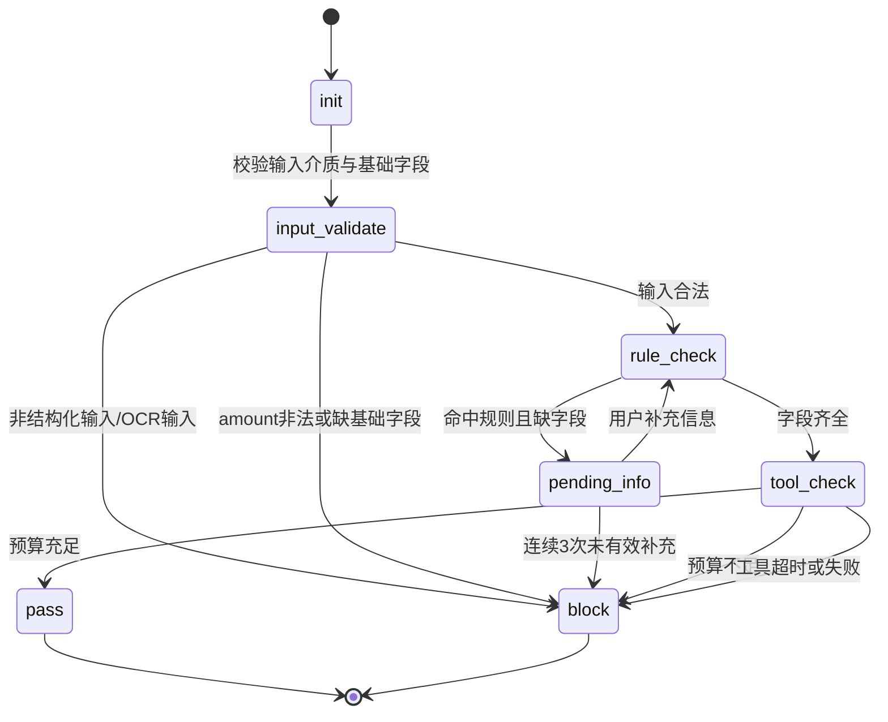

# AI 报销预审助手（Agent 版）PRD

- 版本：v2.0
- 状态：可演示 / 求职作品集版本
- 目标读者：产品经理、招聘方、前端/后端开发、测试

---

## 0. 业务背景与需求来源

### 0.1 需求发现：来自真实经历的痛点

作者曾以汉语教师志愿者身份在海外中小学任教，亲身经历了教育公派项目中报销流程的系统性低效问题。该场景的报销链路如下：

**场景一（个人直报）**：教师本人将发票、收据等单据标注后上传至管理系统，由语合中心财务人员进行人工审核，审核周期通常为 **1～2 个月**，期间报销人无法获知审核进度，处于完全的"黑盒等待"状态。若单据存在问题，财务人员才会主动联系报销人进行补充，而此时距离报销发生往往已过去较长时间。

**场景二（汇总转报）**：针对活动打车费、聚餐等小额报销，由教师先汇总报给管理老师，再由管理老师统一转报语合中心，存在信息传递层级多、字段丢失风险高的问题。

**核心痛点（作者亲历）**：

| 痛点编号 | 痛点描述 | 影响 |
|---|---|---|
| P1 | 审核黑盒：提交后 1～2 个月不知道进度 | 报销人焦虑，无法做资金规划 |
| P2 | 问题发现太晚：审核完才通知有问题 | 补材料成本极高，部分已无法补救 |
| P3 | 回国后无法补单：教师已离境，被要求补发票时只能麻烦仍在境外的同事代办 | 流程中断，多方被动卷入 |
| P4 | 层级转报信息损耗：经管理老师转报时字段不完整或描述模糊 | 财务来回沟通，效率低下 |

**关键洞察**：上述痛点的根本原因不是某一机构的管理问题，而是"**事后人工审核**"模式的结构性缺陷——问题发现节点在提交之后，补救窗口已经关闭或成本极高。这一问题普遍存在于依赖人工审核的企业报销系统中。

### 0.2 从具体场景到通用产品

基于以上洞察，本产品将问题抽象为：

> **如何在报销单据正式提交前，用 AI 自动完成合规预检，将问题发现节点前移？**

目标用户从"海外教育机构教师"扩展为**所有依赖员工自主申报的企业报销场景**，覆盖金融、制造、教育、服务业等多个行业。

### 0.3 为什么选择 Agent 方案而非传统规则引擎

| 方案 | 优点 | 缺点 | 适用场景 |
|---|---|---|---|
| 纯表单校验 | 实现简单，成本低 | 只能校验格式，无法理解语义；无法追问 | 字段简单、规则固定 |
| 传统规则引擎 | 逻辑清晰，可解释性强 | 规则维护成本高；无法处理自然语言补充 | 规则稳定、复杂度低 |
| **ReAct Agent（本方案）** | 支持多轮追问；可理解自然语言；工具调用灵活；规则可扩展 | 实现复杂度较高；需要 Prompt 工程 | **规则复杂、需要多轮交互、字段存在语义模糊性** |

选择 ReAct Agent 的核心理由：报销场景中用户输入天然包含自然语言（如"请客吃饭"），字段补充过程需要多轮对话，同时需要调用外部预算系统——这三点决定了规则引擎无法单独胜任。

---

## 1. 文档信息

- 版本：v2.0
- 状态：可开发 / 可演示
- 目标读者：产品经理、前端/后端开发、测试

---

## 2. 产品定位

面向企业内部报销场景的合规预审 Agent。员工在正式提交单据前，通过自然语言交互完成"自动识别规则、主动追问缺失信息、调用预算工具、输出结构化结论"，将问题发现节点从**事后审核**前移至**提交前预检**，减少财务重复沟通与基础核对成本。

**产品价值主张**：
- 对报销人：提交前就知道单据是否合规，不再"等两个月才发现有问题"
- 对财务：减少来回沟通，聚焦处理真正复杂的审批判断
- 对管理层：合规数据可量化，报销流程可追溯

---

## 3. 目标与非目标

### 3.1 目标（Goals）

1. 在单据提交前拦截显性违规与信息缺失。
2. 通过多轮追问补齐关键字段，降低人工来回沟通。
3. 展示 ReAct + Function Calling 的完整闭环。
4. 输出前端可消费的标准化 JSON 状态，便于 UI 驱动。

### 3.2 非目标（Non-Goals）

1. 不替代正式财务审批流，不进行最终财务入账。
2. 不覆盖全部费用类型，仅覆盖 MVP 核心场景。
3. 不接入真实 ERP，仅使用可替换的模拟工具接口。
4. 不包含 OCR/票据识别能力，不处理图片或 PDF 抽取。

### 3.3 MVP 前置假设与输入边界（无 OCR）

本 MVP 明确以前端已成功获取并传入结构化发票 JSON 为起点。Agent 负责"规则判断、缺失追问、预算校验、结论输出"，不负责票据图片/PDF 的 OCR 识别与字段抽取。

前置假设：
1. 前端提交的数据已完成基础结构化，字段命名遵循 `7.1 前端输入 Schema`。
2. 若上游存在 OCR/录入系统，其输出已在进入 Agent 前完成字段映射与清洗。
3. 本 PRD 只定义"决策层（Agent）"行为，不定义"识别层（OCR）"实现细节。

---

## 4. 核心 MVP 场景

### 4.1 场景名称

业务招待费合规预审。

### 4.2 核心规则（V1）

当 `expense_type=业务招待费` 且 `amount>500` 时，必须提供：
- `client_company_name`（客户企业全称）
- `accompanying_headcount`（内部陪同人数，正整数）

### 4.3 触发机制

前端提交"结构化单据 JSON + 用户自然语言附言"，Agent 自动启动预审流程。

---

## 5. 用户旅程与核心流程

### 5.1 用户旅程阶段

1. 员工录入/导入单据
2. Agent 识别并比对规则
3. 若缺信息则追问补齐
4. 调用预算工具
5. 输出通过/拦截/待补齐结论

### 5.2 流程图（Mermaid）

```mermaid
flowchart TD
    A[前端提交结构化JSON + 用户附言] --> B{输入介质是否为结构化JSON}
    B -- 否 --> B1[返回 block\nreason=当前版本不支持OCR输入]
    B -- 是 --> C{基础字段是否合法\nsession_id/user_id/amount}
    C -- 否 --> C1[返回 block\nreason=输入参数非法]
    C -- 是 --> D[Agent 解析费用类型与金额]
    D --> E{是否命中业务招待费 且 金额>500}
    E -- 否 --> F[进入预算校验]
    E -- 是 --> G{关键信息是否齐全且格式正确}
    G -- 否 --> H[返回 pending_info\nrequired_fields + field_errors]
    H --> I[用户补充信息]
    I --> J{补充次数 < 3}
    J -- 是 --> G
    J -- 否 --> J1[返回 block\nreason=信息补充不完整]
    G -- 是 --> F
    F --> K[调用 query_department_budget(user_id)]
    K --> K1{工具是否成功返回}
    K1 -- 否 --> K2[返回 block\nreason=预算查询失败]
    K1 -- 是 --> L{available_budget >= amount}
    L -- 是 --> M[返回 pass + 操作指引]
    L -- 否 --> N[返回 block + 预算不足]
```

### 5.3 状态机（Mermaid）



---

## 6. 决策表（必须实现）

| 条件编号 | 费用类型 | 金额 | 必填字段齐全 | 预算充足 | 输出状态 | 说明 |
|---|---|---:|---|---|---|---|
| R0 | 任意 | 非法/缺失 | - | - | block | 输入金额非法，直接拦截 |
| R1 | 非业务招待费 | 任意 | - | true | pass | 不命中招待费规则，预算通过 |
| R2 | 非业务招待费 | 任意 | - | false | block | 不命中招待费规则，但预算不足 |
| R3 | 业务招待费 | <=500 | - | true | pass | 金额未超阈值，预算通过 |
| R4 | 业务招待费 | <=500 | - | false | block | 金额未超阈值，但预算不足 |
| R5 | 业务招待费 | >500 | 否 | - | pending_info | 必填信息缺失，发起追问 |
| R6 | 业务招待费 | >500 | 是 | true | pass | 合规信息完整且预算通过 |
| R7 | 业务招待费 | >500 | 是 | false | block | 合规信息完整但预算不足 |

补充规则：
1. `amount=500` 视为"未超阈值"。
2. `accompanying_headcount` 必须为正整数；否则按缺失处理并追问。
3. `pending_info` 连续追问 3 次无有效补充，转 `block`。
4. 在 `pass/block` 场景下，`required_fields` 固定返回空数组 `[]`。
5. 预算是否充足由规则引擎按 `available_budget >= amount` 计算得出。
6. V1 预算桶按"员工所属部门月度通用报销预算"统一计算，不按费用类型拆桶。

---

## 7. 数据结构定义

### 7.1 前端输入 Schema

```json
{
  "session_id": "SES_20260428_0001",
  "user_id": "EMP_001",
  "expense_type": "业务招待费",
  "amount": 850.0,
  "merchant": "XX大酒楼",
  "user_message": "报销昨晚请李总吃饭的费用",
  "client_company_name": "",
  "accompanying_headcount": null
}
```

字段约束：
- `session_id`: 必填，用于多轮会话上下文关联。
- `user_id`: 必填。
- `expense_type`: 必填，V1 枚举值仅支持"业务招待费"与"其他"；非枚举值在服务端归一化为"其他"。
- `amount`: 必填，非负数字。
- `client_company_name`: 条件必填（R5～R7）。
- `accompanying_headcount`: 条件必填（R5～R7），正整数。
- `user_message`: 可选自然语言补充上下文，不作为结构化字段的最终真值来源。

### 7.2 工具接口（Function Calling）

名称：`query_department_budget`

描述：查询指定员工所属部门当前可用预算。工具只返回预算原始值，不直接返回审批结论。

入参：
```json
{ "user_id": "EMP_001" }
```

返回：
```json
{ "available_budget": 5000.0 }
```

异常返回：
```json
{ "error_code": "BUDGET_TIMEOUT", "error_message": "budget service timeout" }
```

### 7.3 Agent 标准输出 Schema（前端强依赖）

```json
{
  "status": "pending_info",
  "reason": "金额超过500元的业务招待费需补充信息",
  "ai_reply": "系统识别此单为业务招待费且超500元。请补充客户企业全称及内部陪同人数。",
  "required_fields": ["client_company_name", "accompanying_headcount"],
  "field_errors": [],
  "next_action": "wait_user_input",
  "tool_trace": { "budget_checked": false }
}
```

`status` 枚举：`pass` / `block` / `pending_info`

`next_action` 枚举：`wait_user_input` / `show_result` / `retry_allowed`

---

## 8. ReAct 与 Agent 行为要求

### 8.1 Agent 规划模式（MVP）

MVP 采用 ReAct 主流程：
1. **Thought（内部）**：识别单据要素、命中规则、判断缺口，不向用户暴露链路细节。
2. **Action（外显）**：当缺字段时先追问；字段齐全后再调用预算工具。
3. **Observation（外显）**：读取工具返回，映射到标准状态输出。
4. **Response（外显）**：始终返回结构化 JSON，并附自然语言解释。

约束：
- 禁止跳过字段补齐直接调用预算接口。
- 禁止输出非 JSON 的终态响应。

### 8.2 Prompt 设计规范（MVP）

**职责分层（必须遵守）**：
- Prompt 负责：语义理解、追问文案、用户可读解释。
- 代码/规则引擎负责：阈值判断、状态流转、重试上限、Schema 校验、工具调用门禁。
- 冲突处理原则：若模型输出与规则引擎冲突，以规则引擎结果为准。

**System Prompt（运行时主提示词）**：
```
你是企业报销预审助手。你的任务是在"已结构化输入"的前提下，完成合规预审并输出严格JSON。

工作边界：
1) 不执行OCR，不处理图片/PDF识别。
2) 不跳过规则校验，不跳过缺失字段追问。
3) 仅在字段齐全时调用预算工具 query_department_budget。

业务规则：
- 当 expense_type=业务招待费 且 amount>500 时，必须提供：
  a) client_company_name
  b) accompanying_headcount（正整数）
- amount=500 视为未超阈值。
- pending_info 连续3次未补齐，返回 block。

输出要求：
1) 只输出JSON，不输出额外文本。
2) JSON字段必须包含：status, reason, ai_reply, required_fields, field_errors, next_action, tool_trace
3) status 仅允许：pass, block, pending_info。
4) 当 status 为 pass 或 block 时，required_fields 必须为 []。
```

---

## 9. 效果评估方案（EDD 方法）

> 本节定义产品上线后的效果衡量标准，以及用于持续评测的数据集设计。这是 AI 产品与传统软件产品的核心区别——除功能正确性外，还需要衡量 AI 决策的质量。

### 9.1 核心业务指标（Success Metrics）

| 指标 | 定义 | MVP 目标值 | 数据来源 |
|---|---|---|---|
| 首次通过率 | 提交后无需追问直接 pass 的比例 | ≥ 60% | 服务端日志 |
| 平均追问轮数 | pending_info 状态下平均几轮补齐 | ≤ 1.5 轮 | session 日志 |
| 拦截准确率 | block 结论中真实违规单占比（减少误拦截） | ≥ 90% | 人工抽检 |
| 追问文案满意度 | 用户对 ai_reply 文案的可理解性评分 | ≥ 4/5 分 | 用户反馈 |
| 工具调用成功率 | query_department_budget 调用成功比例 | ≥ 99% | 工具调用日志 |

### 9.2 评测集设计（EDD：Example-Driven Development）

评测集覆盖所有核心规则分支，用于版本迭代时的回归测试。

**数据集构成**：

| 分组 | 用例数量 | 覆盖场景 |
|---|---|---|
| 正常通过类 | 20 条 | 非招待费/金额未超阈值/字段齐全预算充足 |
| 追问触发类 | 20 条 | 各种缺字段组合、格式错误组合 |
| 拦截类 | 20 条 | 预算不足/工具失败/达追问上限 |
| 边界值类 | 10 条 | amount=500/amount=0/amount=负数 |
| 自然语言歧义类 | 10 条 | user_message 含模糊表达，考验语义提取 |
| **合计** | **80 条** | |

**每条评测用例包含**：
- 输入：完整 JSON（含 user_message）
- 期望输出：`status` / `required_fields` / `next_action`
- 评测维度：状态正确性（必须）、文案可理解性（人工评）、tool_trace 完整性（必须）

**自然语言歧义类示例**：

| 输入 user_message | 期望行为 |
|---|---|
| "陪同了几个同事" | 触发追问，要求填写具体正整数 |
| "请了客户吃饭" | 识别为业务招待费，触发字段追问 |
| "报销昨天打的费用" | 不命中招待费规则，进入预算校验 |

### 9.3 迭代评测流程

```
新版本上线前 → 跑 80 条评测集 → 状态正确率必须 ≥ 95% → 人工抽检追问文案 20 条 → 通过后发布
```

---

## 10. UI 交互设计（MVP 版）

### 10.1 页面布局

- 左侧：单据信息面板（只读）
- 右侧：Agent 对话区域（追问、补充、最终结果）

补充输入框规范：
1. UI 必须提供结构化字段表单（如客户公司、陪同人数）。
2. UI 可提供自由文本输入，但不得替代结构化字段输入。
3. 当后端返回 `next_action=retry_allowed` 时，UI 渲染"重试预算校验"按钮。

### 10.2 状态到 UI 映射

| 状态 | UI 表现 |
|---|---|
| `pending_info` | 黄色提示条 + 缺失字段标签 + 补充输入框 + "继续预审"按钮 |
| `pass` | 绿色结果条 + "可提交正式报销流程"提示 |
| `block` | 红色结果条 + 阻断原因 + 建议动作 |

---

## 11. 异常与边界场景

1. 金额等于 500：不触发附加字段要求。
2. 金额为负/空：直接 `block`，原因"金额非法"。
3. 费用类型缺失：`pending_info` 追问费用类型。
4. 用户补充字段格式错误（人数非正整数）：继续 `pending_info` 并提示格式。
5. 工具超时或失败：`block`，`next_action=retry_allowed`。
6. 用户连续 3 次未补有效信息：`block`，原因"信息补充不完整"。
7. 非结构化输入：返回"当前版本不支持票据识别，请先提供结构化字段"。

---

## 12. 验收标准（Given-When-Then）

1. **规则命中追问**：业务招待费且金额 850，缺客户公司 → `pending_info`，`required_fields` 含 `client_company_name`
2. **补齐后通过**：补齐客户公司与陪同人数，预算充足 → `pass`
3. **预算不足拦截**：信息齐全但预算不足 → `block`，给出预算不足原因
4. **金额边界**：业务招待费金额 500 → 不追问附加字段，直接进入预算校验
5. **格式校验**：陪同人数填为"两人" → `pending_info`，提示"需填写正整数"
6. **工具异常**：预算工具超时 → `block`，reason 为预算服务异常，`next_action=retry_allowed`
7. **追问次数上限**：连续 3 次未提供有效补充 → `block`，reason 为信息补充不完整
8. **输入介质边界**：上传图片/PDF 未提供结构化字段 → `block`，提示需提供结构化数据
9. **Prompt 输出约束**：模型响应必须为合法 JSON，包含所有必要字段
10. **Tool 调用门禁**：命中招待费规则且字段不齐全时，不得调用 `query_department_budget`
11. **reply 字段冲突优先级**：结构化字段 `accompanying_headcount=2` 优先于 `reply_message` 提取值
12. **部分补齐计数重置**：本次补齐任一缺失字段，无效回复计数重置为 0
13. **非枚举费用类型归一化**：`expense_type=差旅费` → 归一化为"其他"
14. **会话过期处理**：`session_id` 超过 TTL → `block`，reason 为"会话已失效"
15. **恶意/组合边界输入**：`amount=0` 且 `expense_type` 缺失 → 响应 JSON 结构完整可解析

---

## 13. V2 产品规划（迭代展望）

> 本节说明 MVP 上线后的下一步方向，体现产品迭代思维。

| 版本 | 核心新增能力 | 解决的新痛点 |
|---|---|---|
| V2.0 | 接入 OCR 模块，支持拍照上传票据自动识别字段 | 消除"必须先结构化录入"的前置门槛 |
| V2.1 | 支持更多费用类型（差旅费、办公费等），规则可配置化 | 覆盖更多企业报销场景 |
| V2.2 | 接入真实 ERP 系统（如用友、SAP），预算数据实时同步 | 消除模拟数据，实现真实预算校验 |
| V3.0 | 历史数据分析：报销合规率趋势、部门预算消耗预警 | 为管理层提供决策数据支撑 |

**V2.0 OCR 接入说明**：当前 MVP 明确将 OCR 排除在外（Non-Goal），是为了聚焦验证 Agent 决策层的核心逻辑。OCR 模块作为独立的"识别层"，可在 V2.0 中以插件形式接入，不影响现有 Agent 架构。

---

## 14. 关于本项目

本项目为作者个人独立设计，起源于海外汉语教师志愿者任职期间对报销流程的亲身观察。作者独立完成了需求分析、产品方案设计、PRD 撰写及前端交互原型设计。后端实现采用模拟接口，以完整展示 Agent 产品逻辑闭环。

**项目亮点**：
- 从真实用户痛点出发，完成需求抽象与产品通用化设计
- 完整覆盖 AI PM 核心方法论：需求调研 → 方案选型 → PRD → 评测集设计 → 迭代规划
- 体现对 ReAct Agent、Function Calling、Prompt 工程的产品层理解
- 前端原型已完成，可演示完整交互流程
